# Lab 01 Report - Introduction to Open Source Software

## Name: Nick Arnold
## Email: arnoln2@rpi.edu
## Github Account: 0NotApplicable0
## Discord Handle: NA

### Lab01 - Part 1:

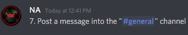

### Lab01 - Part 2

#### Eric Raymond's Article:
Asking questions is importatnt, before doing you must understand. Two additions I could add to Eric Raymond's Smart Questions are:

    1. Eric has the rule of "Be explicit about your question" I can agree with this but I have something to add. Not only should you be explicit about a question but the asker should do their best to provide a possible example in context. In context is the most important thing! This will help frame what your current understanding is to the askee.

    2. Another rule of Eric's is, "Courtesy never hurts, and sometimes helps". This is worth the world to me, being kind, greatful, and understanding really goes miles. And instead of saying, "...never hurts..." I think everyone should always, always. be considerate when asking or answer questions.

#### Free Culture Paragraph: 

    I think Chapter Three: Catalogs of Free Culture has quite a bit in it. I liked the RPI plug at the start! I was very disturbed to read what I did about Jesse. In my opinion I think the legal system failed Jesse and I personally think that RPI also failed Jesse. Setting up a system like Jesses is hard to do and impressive what Jesse did was a step into the future. I think everyone can learn from this experience and take out of it what you will but I personally think that Jesse was robbed. These music companies should be ashamed at what they did, they should have been happy with Jesse taking the system down but they had to go further and steal his savings. I also think that RPI could have done something to help, they should have notified Jesse to take the system down and assist him and fighting this case. In the end, Jesse was punished for being creative.

### Lab 01 - Part 3

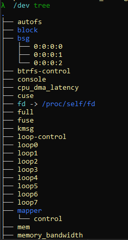

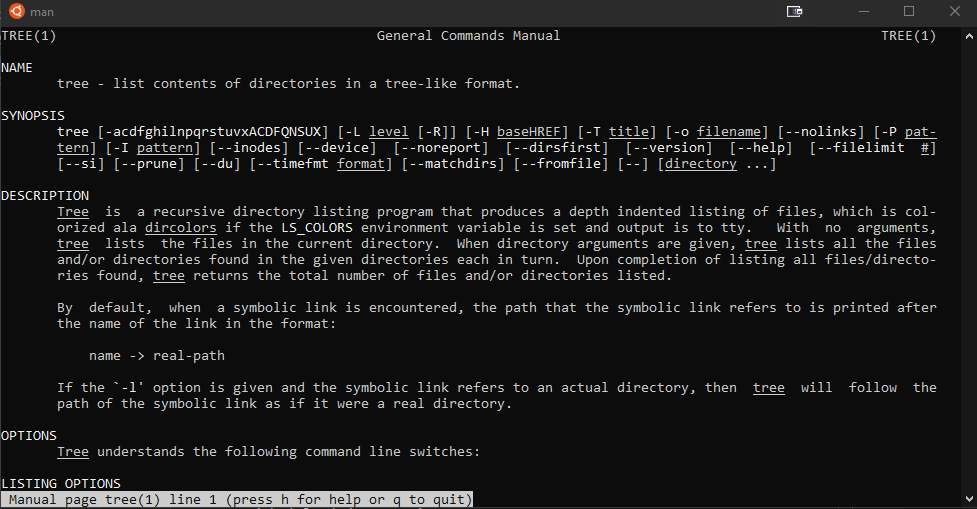

### Lab 01 - Part 4

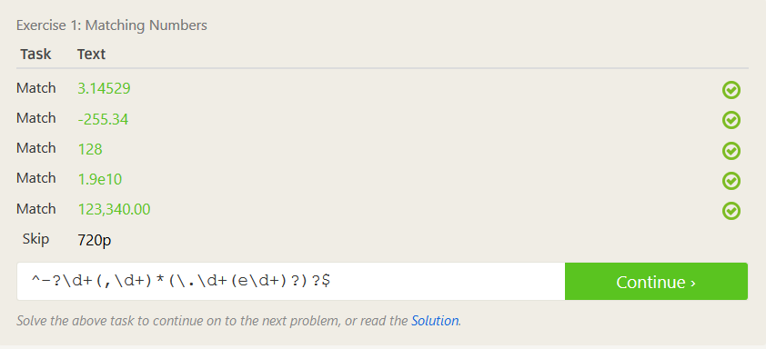

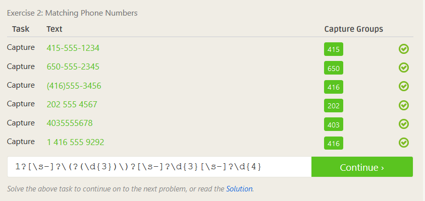

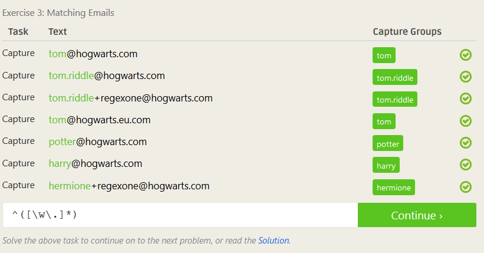

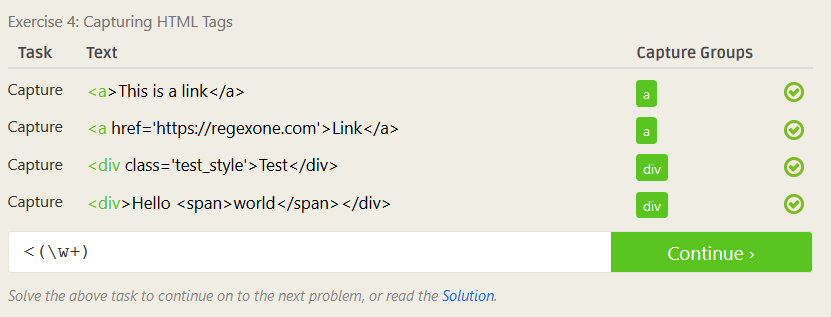

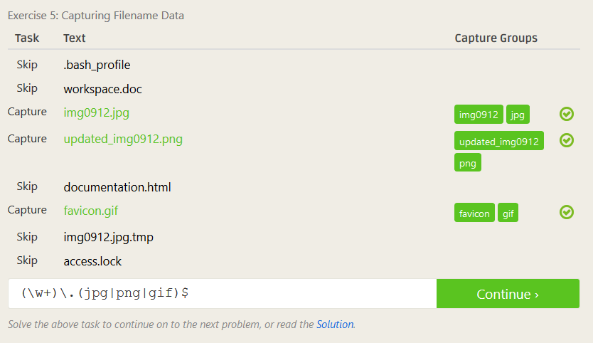

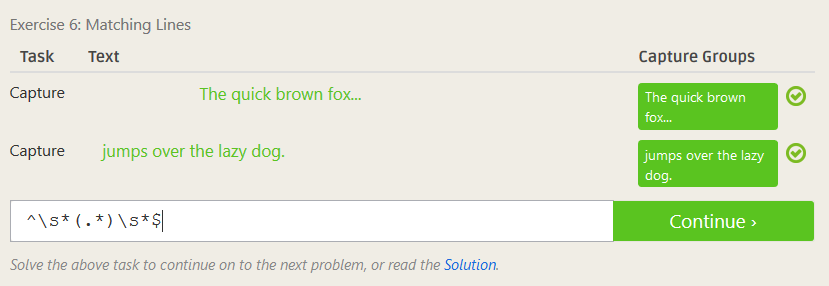

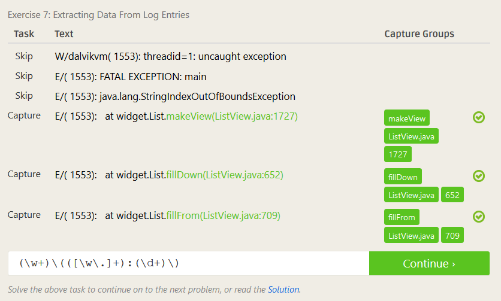

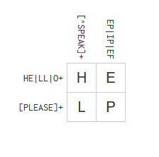

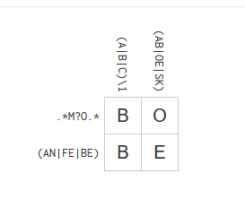

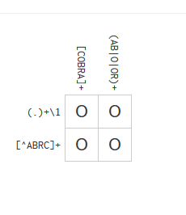

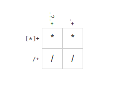

### Lab 01 - Part 5

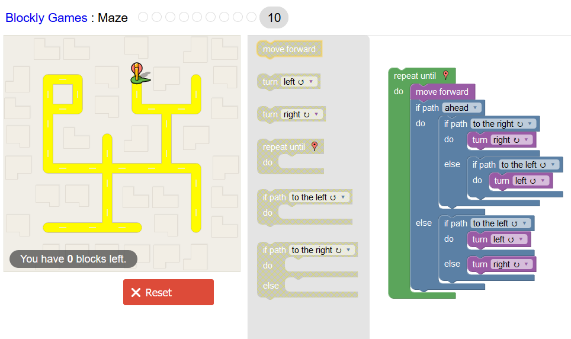

### Lab 01 - Part 6

I am interested in the open source project Submitty. I have used Submitty the past few years for my Computer Science projects and I think I have some ideas that could be implimented. An addition of a private messaging system within Submitty would be a really great addition to the project. To go about additing this feature I would go to the Submitty GitHub and then create a branch or fork the repository. I would impliment the feature and then use a pull request to get the changes into Submitty. Then someone within the Submitty project would review the changes and then approve or deny them.