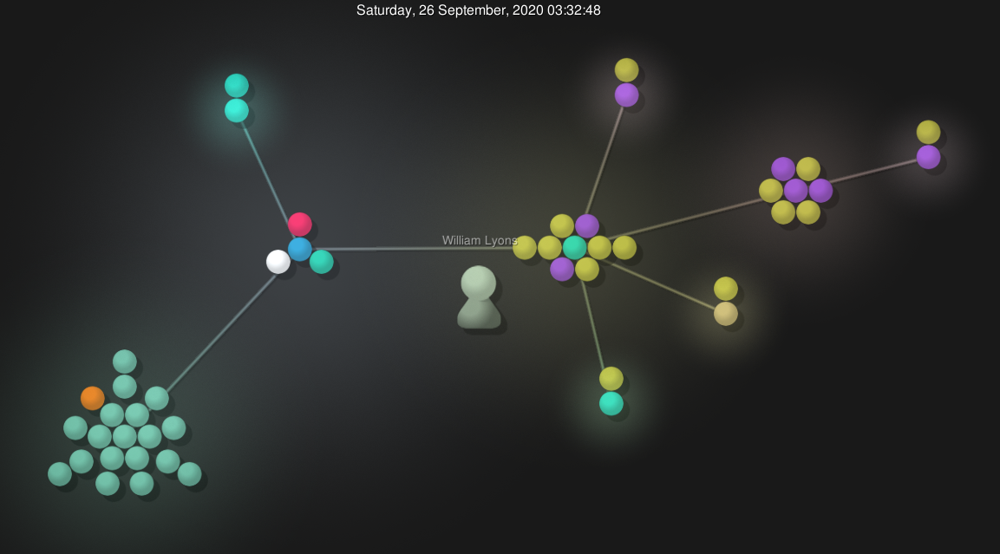

## Interesting Projects Wiki
Like I've said before, I really don't care what type of project I work on. I joined the OSS class to learn about open source licences and the structure of open souce software. Maybe one project idea I could work on would be automated homeless food distribution systems.

The problem area of the software I am trying to create is auto food distibution to the homeless in big cities. I don't think there is existing software that does this. In big cities there would be automated distribution boxes. Homeless people walk up and scan their face. After that a care package will be distibuted. We would use a full stack system. Node or dotnet for the backend, and maybe typescript React or C# blazor for the frontend. The end goal would be to feed the homeless in big cities. 

## LaTeX:
    $\sqrt{1 + 2 \sqrt{1 + 3 \sqrt{1 + 4 \sqrt{1 + ...}}}}$

    $\sqrt{2}^{\sqrt{2}^{\sqrt{2} ^ {\sqrt{2} ...}}}$

    $
    \begin{bmatrix}
    1 & 1 & 1 & 1\\
    -1 & 1 & -1 & 1\\
    1 & -1 & 1 & 1\\
    1 & -1 & -1 & 1
    \end{bmatrix}
    $

## Project Info

### Flutter ShuttleTracker
- Number of contributors: 5       
- Lines of code: 37461
- First commit: Initial commit (3e7e97dfa70dc480a5a68b7ff70a8575bd93af50)
- Latest Commit: Commented Code and Documentation of the settings_page directory (63400bcc58b3dd0fdb4c626b56c04e3c242b8397) On branch (eta_panel)
- Number of branches: 13

### onmyownti.me
- contributors: 1
- lines of code: 2251
- first commit: "Initial commit" https://github.com/omot/onmyownti.me/commit/71a5be1c6422e8fe7a4467be5b58724a0cdcaae3
- latest commit: "updated theme to fix font" https://github.com/omot/onmyownti.me/commit/f8656e4ad6fbd35cb03b01897c5d03b9ad3d59d3
- current branches: "main", "preview"

### Insomnia Dialogue System
- the number of contributors: 3
- number of lines of code: 85996 total
- the first commit: commit 7d2dcb71edad3a3abdaf91b8ca8cd31a77752072 - "Initial Commit" on branch: master
- the latest commit: commit e5ada154e210d1962f7912b9989713620822de51 - "Final Push. Horizontal Scroll rects and generating buttons is good to go" on branch: master
- the current branches: just master

### MarketBot
- Number of branches: 8
- Number of contributors: 4
- Lines of code: 2313
- First commit: Initial commit (fa857b000c2c85ab167a19eb1b02ed26c16a891d)
- Latest Commit: Retrying drop gitignore files (77b7b88c2c12b1d153f1f19893827aafdac2811b) On branch master

## Gitstats
When getting the data manually it was a long process of manually moving around and typing things in. Gitstats was much more automated and it seems like Gitstats also showed some more information. For example, the number of contributors was different in Gitstats than the manual process for the Insomnia Diaogue System.

## Gsource

