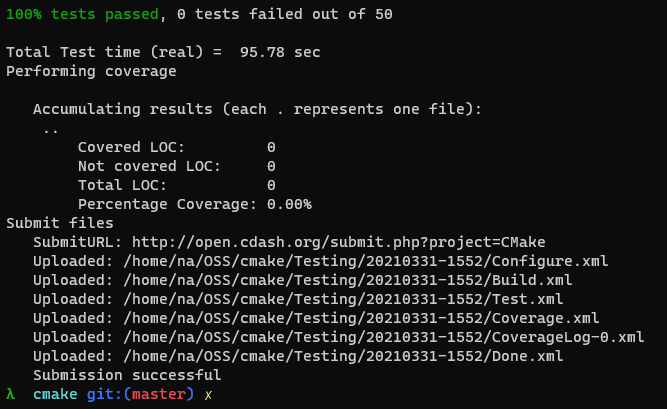

# Lab 7

## Checkpoint 1

- The make was very large and only the last part of it is incldued.

## Checkpoint 2

- [Link to build dashboard](https://open.cdash.org/viewSite.php?siteid=74983&project=1&currenttime=1617152400)

## Checkpoint 3

- Test with faulty Copyright:

- Test with fixed Copyright:

        The error in the Copyright was the date, it was 2000-2020 where 
        it should have been 2000-2021.

## Checkpoint 4

- [Repository](https://github.com/0NotApplicable0/OSS-Lab7/actions)

