# Lab 8

## Example 00:

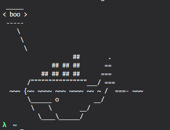

## Example 01:

### Running ubuntu in docker

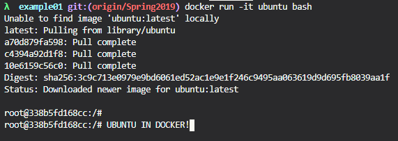

### Creating a file with VIM

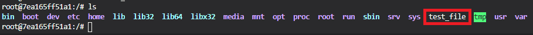

### Installing Cowsay

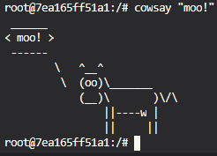

## Example 02:

### Starting Mongo

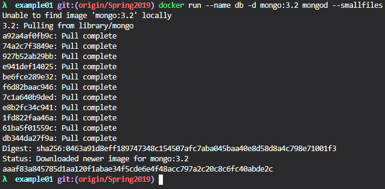

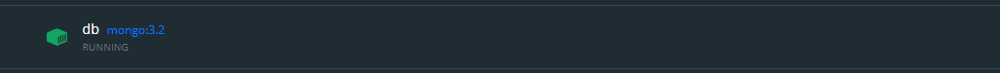

### Setting up Rocket Chat

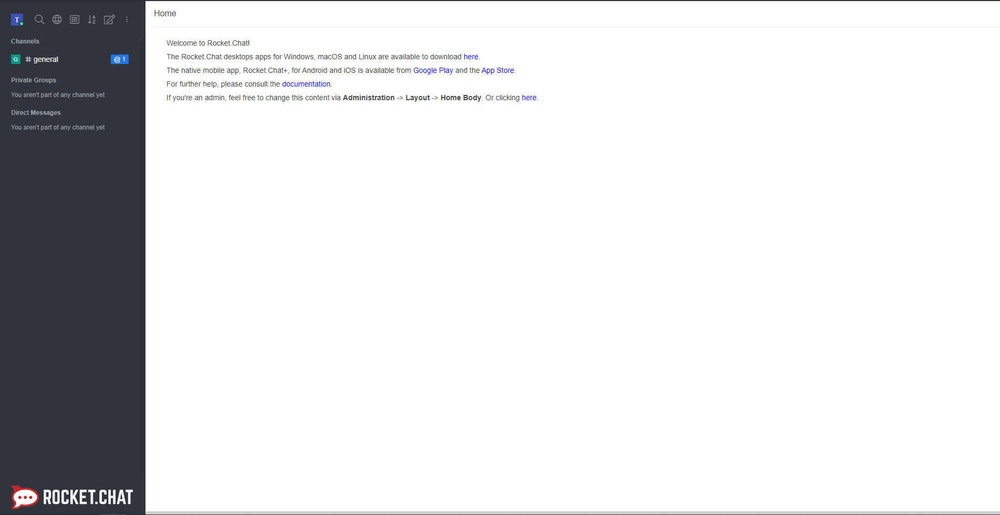

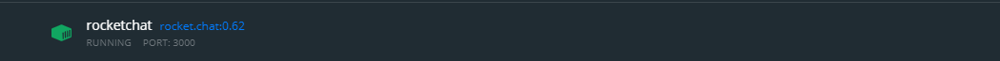

## Example 03:

### Building and running a DockerFile

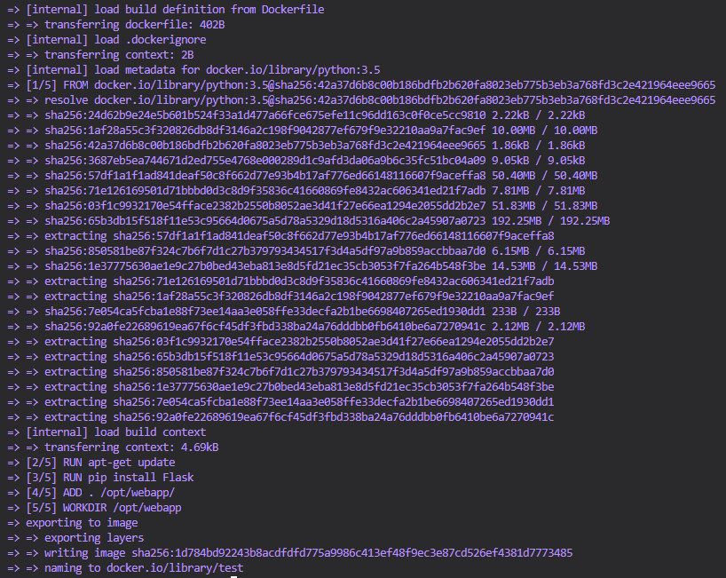

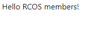

## Example 04:

### Creating a Dockerfile for the app

 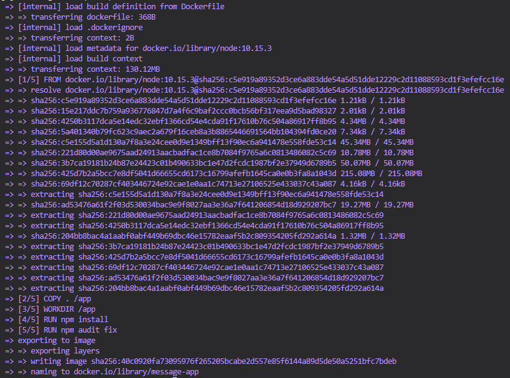

 Note that when you run the DockerFile it crashes because there is not MongoDB server setup, I think this is the expected result.

### Creating docker-compose file

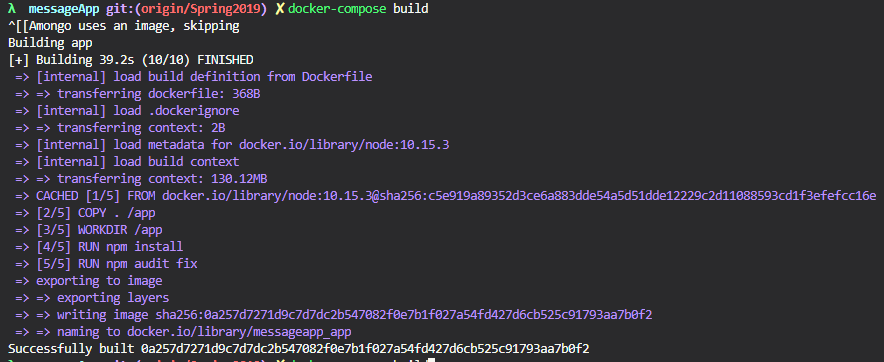

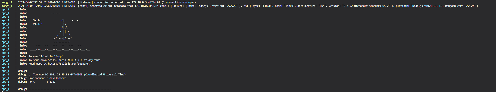

To get the server to work I had to change the port, I guess something is running on 1337

Responses from server:

        [
        {
            "text": "hello",
            "createdAt": "2015-11-08T13:15:15.363Z",
            "updatedAt": "2015-11-08T13:15:15.363Z",
            "id": "5638b363c5cd0825511690bd" 
        },
        {
            "text": "hola",
            "createdAt": "2015-11-08T13:15:45.774Z",
            "updatedAt": "2015-11-08T13:15:45.774Z",
            "id": "5638b381c5cd0825511690be"
        }
        ]

And 

        [
        {
            "text": "hey",
            "createdAt": "2015-11-08T13:15:15.363Z",
            "updatedAt": "2015-11-08T13:19:40.179Z",
            "id": "5638b363c5cd0825511690bd"
        }
        ]