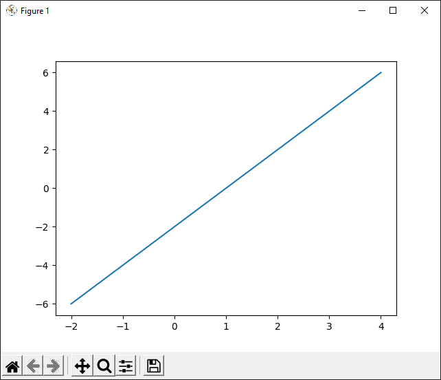
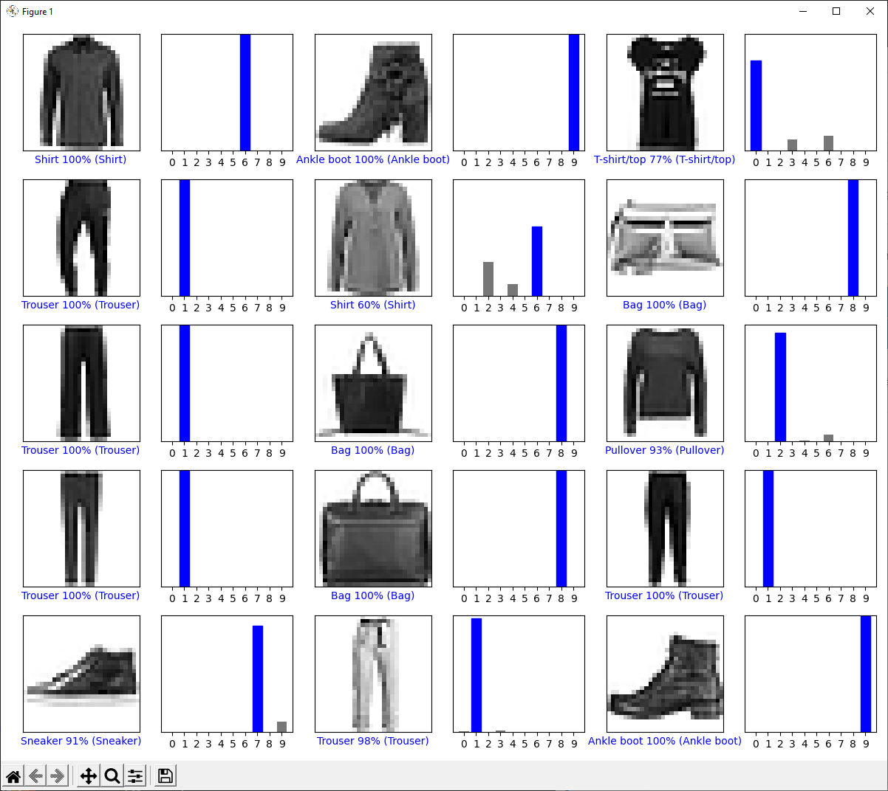
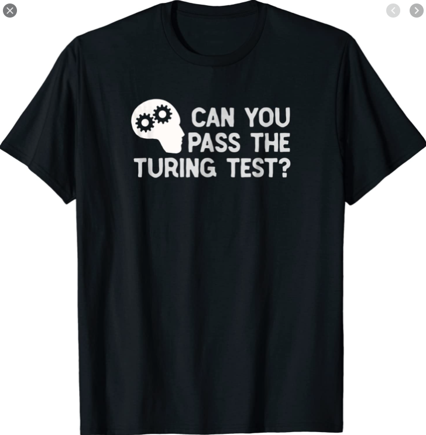
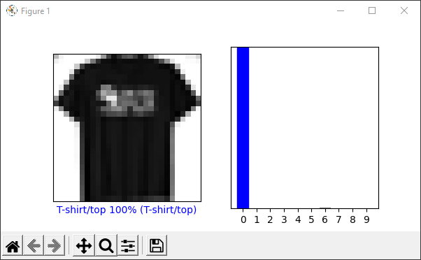
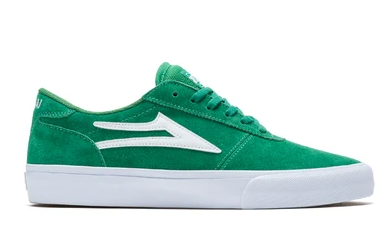
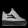
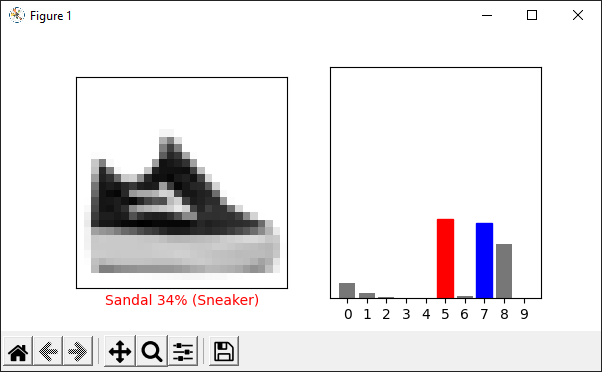
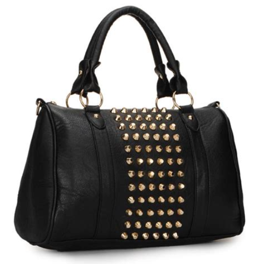
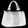
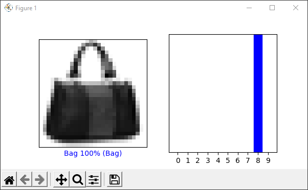

# Lab 10

 

## Checkpoint 1

TensorFlow graph output:

## Checkpoint 2

Graphed images for the 15 images from 9000 - 9014

## Checkpoint 3

### Test image 1:

Full Size: 

Scaled:

Output: 

This worked great, got it 100%

### Test image 2:

Full Size:

Scaled:

Output:

This almost got there, it was split between whether it was a 
sneaker or a sandal and ended up going with sandal. It also somewhat
thought it was a shirt.

### Test image 3:

Full Size:

Scaled:

Output:

This one was also 100% and got it right!
